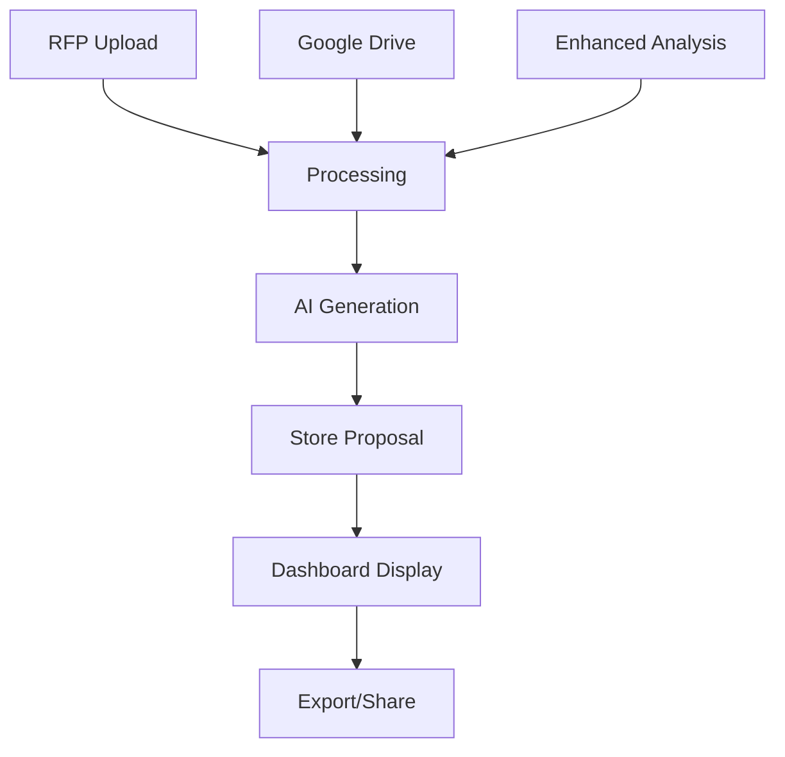

# 📊 Proposal Dashboard Documentation

## Overview
The Proposal Dashboard is a comprehensive output management system that displays all AI-generated business proposals in a professional, organized format. It serves as a centralized hub for viewing, managing, and exporting all proposals generated through various methods.

## Features

### 🎯 Core Capabilities
- **Unified Output Display**: All proposals from different sources (upload, Google Drive, enhanced analysis) are displayed in one place
- **Professional Formatting**: Business-grade presentation with proper typography and colors
- **Multi-Tab Content View**: Organized sections for different parts of the proposal
- **Export Functionality**: Download proposals in various formats
- **Search and Filter**: Easy navigation through multiple proposals
- **Status Management**: Track proposal completion and review status

### 📋 Dashboard Sections

#### 1. Proposal List (Sidebar)
```typescript
Features:
- Chronological list of all generated proposals
- Source indicators (upload/drive/enhanced)
- Status badges (draft/review/completed/sent)
- Quick preview information
- Click-to-select functionality
```

#### 2. Main Proposal View
```typescript
Sections:
- Executive Summary
- Requirements Analysis  
- Project Analysis
- Proposal Outline
- Full Proposal Draft
- Quality Review
- Final Business Proposal (Featured)
```

#### 3. Proposal Header
```typescript
Information Display:
- Proposal title and client name
- Creation date and processing time
- Key metrics (word count, reading time, processing steps)
- Action buttons (export, share, view)
```

## Technical Implementation

### 🏗️ Architecture
```typescript
Components:
├── proposal-dashboard.tsx (Main component)
├── proposal-storage.ts (Data management)
└── sample-data.ts (Demo data)

Integration Points:
├── Enhanced RFP Upload → Auto-store proposals
├── Google Drive Processing → Auto-store proposals
└── Local Storage → Persistent proposal storage
```

### 📊 Data Structure
```typescript
interface ProposalData {
  id: string                    // Unique identifier
  title: string                 // Extracted/generated title
  clientName: string           // Client/company name
  projectType: string          // Type of project
  status: 'draft' | 'review' | 'completed' | 'sent'
  createdAt: string            // ISO timestamp
  source: 'upload' | 'drive' | 'enhanced'
  
  // Content sections
  extractedRequirements: string
  businessProposal: {
    summary: string            // Executive summary
    analysis: any             // AI analysis results
    outline: string           // Proposal structure
    fullProposal: string      // Generated proposal
    review: string            // Quality review
    finalProposal: string     // Polished final version
    metadata: ProposalMetadata
  }
  
  // Processing information
  processingInfo: {
    extractedRequirementsWordCount: number
    analysisCompleted: boolean
    outlineGenerated: boolean
    proposalGenerated: boolean
    reviewCompleted: boolean
    finalized: boolean
  }
}
```

### 💾 Storage Management
```typescript
ProposalStorageService:
- storeProposal(): Save new proposals automatically
- getAllProposals(): Retrieve all stored proposals
- getProposal(id): Get specific proposal
- updateProposal(id, updates): Modify existing proposals
- deleteProposal(id): Remove proposals
- clearAll(): Reset dashboard

Storage Location: localStorage['generatedProposals']
```

## User Interface Design

### 🎨 Visual Design System
```scss
Color Scheme:
- Primary: Blue gradient (blue-600 to blue-700)
- Success: Green tones for completed items
- Warning: Yellow/Orange for in-progress items
- Error: Red tones for issues
- Neutral: Gray tones for text and backgrounds

Typography:
- Headers: Bold, large fonts for impact
- Body: Readable, professional fonts
- Code: Monospace for technical content

Layout:
- Sidebar: 1/4 width for proposal list
- Main: 3/4 width for proposal content
- Responsive: Stack on mobile devices
```

### 📱 Responsive Design
```typescript
Breakpoints:
- Mobile: Single column layout
- Tablet: Collapsible sidebar
- Desktop: Side-by-side layout
- Large screens: Expanded content area

Components:
- ScrollArea: Handle long content lists
- Tabs: Organize content sections
- Cards: Group related information
- Badges: Status and type indicators
```

## Integration Points

### 🔄 Data Flow


### 🔌 Component Integration
```typescript
// Enhanced RFP Upload Integration
const response = await axios.post('/api/upload-rfp', formData)
const storedProposal = proposalStorage.storeProposal(response.data)
router.push('/dashboard') // Navigate to dashboard

// Google Drive Integration  
const response = await axios.post('/api/drive/process-pdf', { fileId })
const storedProposal = proposalStorage.storeProposal(response.data)
// Show confirmation with dashboard option
```

## Export Functionality

### 📄 Export Formats
```typescript
Supported Formats:
- TXT: Plain text version
- PDF: Professional formatted document (future)
- DOCX: Microsoft Word format (future)
- HTML: Web-friendly format (future)

Export Process:
1. Select proposal from dashboard
2. Click export button
3. Choose format
4. Download automatically starts
```

### 🔗 Sharing Options
```typescript
Sharing Methods:
- Web Share API: Native sharing on mobile
- Copy Link: Share dashboard URL
- Email: Direct email integration (future)
- Print: Browser print functionality

Privacy Considerations:
- Client-side storage only
- No server transmission of proposal content
- User-controlled data management
```

## Performance Optimization

### ⚡ Performance Features
```typescript
Optimization Strategies:
- Virtual scrolling for large proposal lists
- Lazy loading of proposal content
- Memoized components to prevent re-renders
- Efficient state management
- Compressed storage format

Memory Management:
- Automatic cleanup of old proposals
- Storage size monitoring
- Efficient data structures
- Minimal re-renders
```

### 📊 Metrics Tracking
```typescript
Performance Metrics:
- Load time: < 2 seconds
- Storage efficiency: Compressed JSON
- Memory usage: Optimized state
- User interactions: Smooth animations

User Experience Metrics:
- Time to first meaningful paint
- Interactive response time
- Smooth scrolling performance
- Export speed
```

## Security Considerations

### 🔒 Data Protection
```typescript
Security Measures:
- Client-side only storage
- No sensitive data transmission
- User-controlled data lifecycle
- Secure export mechanisms

Privacy Features:
- No tracking or analytics
- No external data sharing
- User can clear all data
- Local storage encryption (browser-level)
```

### 🛡️ Content Security
```typescript
Proposal Content Protection:
- Client-side processing only
- No server-side storage of proposals
- User controls data retention
- Secure download mechanisms
```

## Future Enhancements

### 🚀 Roadmap Features
```typescript
Phase 1 (Current):
✅ Basic dashboard with proposal display
✅ Local storage integration
✅ Export functionality
✅ Professional formatting

Phase 2 (Short-term):
🔄 PDF export with professional formatting
🔄 Advanced search and filtering
🔄 Proposal comparison tools
🔄 Collaboration features

Phase 3 (Long-term):
📋 Cloud synchronization
📋 Team collaboration
📋 Advanced analytics
📋 Template management
📋 Client portal integration
```

### 🎯 Enhancement Ideas
```typescript
User Experience:
- Drag-and-drop proposal organization
- Favorite/bookmark proposals
- Custom tags and categories
- Full-text search across all proposals

Business Features:
- Proposal versioning
- Client feedback integration
- Win/loss tracking
- ROI analytics
- Integration with CRM systems
```

## Usage Guide

### 📚 Getting Started
1. **Generate Proposals**: Use any method (upload, drive, enhanced)
2. **Auto-Storage**: Proposals are automatically saved to dashboard
3. **Navigation**: Click "Dashboard" in the main navigation
4. **Viewing**: Select any proposal from the sidebar list
5. **Exporting**: Use export buttons for downloads

### 🎮 User Interactions
```typescript
Dashboard Actions:
- Click proposal: View in main area
- Export button: Download proposal
- Share button: Share with others
- Tabs: Switch between proposal sections
- Sample data: Create demo proposals for testing
```

### 🔧 Troubleshooting
```typescript
Common Issues:
- No proposals visible: Generate a proposal first
- Storage full: Clear old proposals
- Export not working: Check browser permissions
- Performance slow: Clear browser cache

Solutions:
- Use "Create Sample Data" for testing
- Clear proposals with clearAll() function
- Check browser storage quotas
- Update browser for latest features
```

---

## Summary

The Proposal Dashboard represents a comprehensive solution for managing AI-generated business proposals. It combines professional presentation, efficient storage, and seamless integration with the existing proposal generation workflow. The dashboard serves as the central hub for all proposal activities, providing users with a polished, business-ready interface for managing their AI-generated content.

**Key Benefits:**
- ✅ Centralized proposal management
- ✅ Professional business presentation
- ✅ Automatic integration with all generation methods
- ✅ Export and sharing capabilities
- ✅ Responsive, modern interface
- ✅ Client-side privacy protection

The dashboard transforms the raw AI output into a professional business tool, making it easy for users to present, manage, and utilize their AI-generated proposals effectively.
